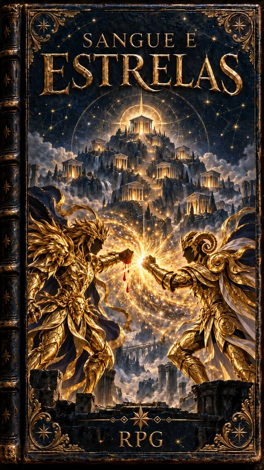

<p align="center">
  
</p>

<h1 align="center">Sangue e Estrelas</h1>

<p align="center">
  <em>Uma armadura feita de estrelas escolheu você. Ela vai quebrar, vai morrer,<br>
  e vai voltar com o seu sangue. Você também.</em>
</p>

<p align="center">
  <a href="https://madeiragab.github.io/Sangue-e-Estrelas/"></a>
  <a href="https://github.com/madeiragab/Sangue-e-Estrelas/actions/workflows/ci.yml"></a>
  
  
</p>

<p align="center">
  <a href="https://madeiragab.github.io/Sangue-e-Estrelas/"><strong>Página inicial</strong></a> ·
  <a href="https://madeiragab.github.io/Sangue-e-Estrelas/livro.html"><strong>Ler o livro</strong></a> ·
  <a href="sim/RESULTADOS.md">Resultados do simulador</a> ·
  <a href="CHANGELOG.md">Changelog</a>
</p>

---

**Sangue e Estrelas** é um RPG de mesa de fã inspirado em *Os Cavaleiros do Zodíaco*.
Um sistema d20 em que o Cosmo cresce durante a luta, o Sétimo Sentido tem preço, o
Ouro domina e a armadura quebra, morre e volta com sangue.

O que separa o projeto de um documento de regras é o **simulador**. Cada número de
combate do livro passou por milhares de duelos rodados com as próprias regras do livro,
e as tabelas de níveis, de Posto e as fichas de inimigos são geradas por ele na hora do
build. O livro e o simulador não têm como discordar.

**Versão atual:** 0.5.0 · 27/09/2026 · [Changelog](CHANGELOG.md)

## O jogo em seis linhas

| | |
|---|---|
| 🎲 **A rolagem** | `1d20 + modificador (+ proficiência)` contra um alvo. Quem causa rola; a defesa é um número fixo. |
| ✨ **O Cosmo** | Começa baixo e sobe a cada rodada e a cada golpe que entra. Paga as técnicas. Perder PV nunca dá Cosmo. |
| 🌌 **Os Sentidos** | O Ouro entra no Sétimo quando quer, e domina. O Bronze só desperta no limite: Cosmo no Teto, um sacrifício e uma Convicção. |
| 👁️ **Os cinco sentidos** | Ninguém fecha um sentido porque quer. O inimigo arranca, ou você se mutila — e cada um que vai embora sobe o seu Cosmo. |
| 🛡️ **A armadura** | DEF e Resistência. Aparar gasta 1 de Resistência e corta o golpe pela metade. Ela morre, só revive com sangue, e cada forma nova é mais forte. |
| 🔥 **Levantar** | A 0 PV você cai, mas não morre. Uma vez por luta, uma Convicção dita em voz alta te põe de pé — e um Bronze levanta desperto. |

## O que o simulador mediu

Duelos do mesmo nível, 1500 por célula, sementes fixas. O traço é um Posto que ainda
não existe naquele nível: Prata só a partir do 9, Ouro só a partir do 15. A tabela
completa está em [`sim/RESULTADOS.md`](sim/RESULTADOS.md).

| Confronto | Nível 1 | Nível 9 | Nível 15 | Nível 20 |
|---|---:|---:|---:|---:|
| Espelho, Bronze contra Bronze | 49% | 49% | 49% | 47% |
| Bronze contra Prata | — | 13% | 11% | 9% |
| Bronze sozinho contra Ouro | — | — | 2% | 0% |
| Bronze com a Centelha de um amigo contra Ouro | — | — | 7% | 1% |
| Armadura de Bronze revivida três vezes contra a original | 63% | 60% | 61% | 65% |
| Bronze com a escada do sangue inteira contra Ouro | — | — | 9% | 5% |
| Quem nunca apara a armadura | 40% | 35% | 35% | 27% |
| Quem nunca levanta do chão | 9% | 3% | 1% | 0% |

O Bronze perde para o Prata e perde muito mais para o Ouro. Uma armadura que morreu e
voltou fica um pouco mais forte a cada forma nova, mas nem com o sangue de um deus iguala
o Ouro.
Das raras vitórias de um Bronze sobre um Ouro, mais de 95% vieram depois de levantar do
chão, e o Bronze terminou a luta com um quinto dos PV. É o anime: um Bronze vence um Ouro
por um milagre, com ajuda, e quase morrendo.

### As vezes em que o simulador contrariou o rascunho

1. **A Guerra dos Mil Dias travava 95% das lutas equilibradas.** A condição era "o mesmo
   Teto de Cosmo", e dois guerreiros do mesmo nível sempre têm o mesmo Teto. Agora ela
   começa num choque de técnicas — o mesmo número natural na mesma rodada — e acontece em
   14% a 17% das lutas entre Ouros.
2. **Queimar o Cosmo vencia 80% dos duelos nos níveis altos.** O preço era fixo e o ganho
   crescia com o Grau. Agora o preço cresce junto, e quem nunca queima vence de 42% a 52%.
3. **No nível 5, dar só golpes comuns rendia tanto quanto usar técnicas.** Era o Ataque
   Extra chegando junto com uma armadura que cortava toda técnica pela metade. O Ataque
   Extra foi para o nível 9, e aparar passou a gastar a reação.

### O teste de estresse

Além do jogo normal, [`sim/extremos.py`](sim/extremos.py) tenta quebrar o sistema:
builds tortas, técnicas de condição, limitações baratas, políticas exageradas, recursos
no zero e no máximo, diferenças grandes de nível e de Posto, a escada do sangue inteira e
lutas de grupo contra um só. O relatório completo está em
[`sim/EXTREMOS.md`](sim/EXTREMOS.md). O que ele achou e o que mudou:

| Achado | Antes | Depois |
|---|---:|---:|
| Quatro Bronzes contra um Ouro do mesmo nível | 99% a 100% | 38% a 42% |
| Quem luta pelo Cosmo contra quem luta pela DES | 21% a 38% | 39% a 59% |
| Quem tem uma técnica de atordoar | até 89% | 48% a 60% |
| Quem tem uma técnica com limitação | — | 28% a 56% (nenhuma é brecha) |
| Cada característica de armadura, sozinha | — | 45% a 62% |

## O livro

Um livro só, para jogador e Mestre, com 13 capítulos:
[**ler online**](https://madeiragab.github.io/Sangue-e-Estrelas/livro.html).

| | Capítulo | Conteúdo |
|---|---|---|
| I | Antes de tudo | O que é o jogo e o que você precisa |
| II | Como se joga | O d20, a dificuldade e os cinco números da ficha |
| III | Criação de personagem | Nove etapas, sem classes: exército, constelação, treino, Convicções |
| IV | Cosmo e Sentidos | O Cosmo que cresce, queimar, o Sétimo dominado, a Guerra dos Mil Dias, o Oitavo, o Nono, os cinco sentidos e as Centelhas |
| V | Combate | Ações, reações, "o mesmo golpe não funciona duas vezes", cair e levantar, condições |
| VI | Técnicas | O motor para criar as suas, evolução e o Golpe do Assento |
| VII | Armaduras | Características, Resistência, a Hierarquia do Prata, a morte, a escada do sangue com o bônus de cada forma nova e a forma Divina |
| VIII | Itens e relíquias | Raridade, Sintonia, remédios, os três metais, melhorias e relíquias — nenhuma arma |
| IX | Exércitos | O molde e quatro exércitos de exemplo |
| X | Inimigos | Como montar, a dificuldade medida e sete fichas prontas |
| XI | Aliados e a luta na mesa | Aliados, mentores, duelos em paralelo e a Guerra dos Mil Dias na mesa |
| XII | Interlúdio e níveis | Glória, as ações de Interlúdio, o Posto e a tabela de 1 a 20 |
| XIII | Uma ficha pronta | Um personagem inteiro, um modelo de ficha e a consulta rápida |

## Estrutura do repositório

| Caminho | O que é |
|---|---|
| `template/livro.html` | A casca do livro: capa, folha de rosto, sumário, colofão |
| `template/capitulos/*.html` | Um arquivo por capítulo — é aqui que as regras moram |
| `template/livro.css` | A folha de estilo |
| `sim/regras.py` | Todos os números do sistema num lugar só |
| `sim/tecnica.py` | O motor de técnicas do Capítulo Seis, em código |
| `sim/luta.py` | A luta inteira, rodada a rodada, com as regras do livro |
| `sim/inimigos.py` | Os inimigos prontos e as tabelas que o build imprime no livro |
| `sim/cenarios.py` | Os experimentos; gera `sim/RESULTADOS.md` |
| `sim/extremos.py` | O teste de estresse; gera `sim/EXTREMOS.md` |
| `test.py` | Contas das técnicas, build do livro e metas de equilíbrio |
| `build.py` | Monta o `livro.html` final, com CSS, capa e tabelas embutidos |
| `regras/decisoes.md` | Cada decisão de design e de onde ela veio |
| `pesquisa/` | O relatório de referências e as notas da pesquisa |

## Rodar

Nada para instalar: é Python puro, da biblioteca padrão.

```bash
python build.py          # monta o livro.html
python test.py           # tudo: técnicas, livro e equilíbrio (alguns segundos)
python sim/cenarios.py   # regenera sim/RESULTADOS.md (menos de um minuto)
python sim/extremos.py   # o teste de estresse; regenera sim/EXTREMOS.md (alguns minutos)
```

O `test.py` falha se uma técnica impressa não bater com o motor, se um link interno
apontar para o nada, ou se uma meta de equilíbrio sair do lugar — o espelho perto de
50%, a luta entre 3 e 11 rodadas, o Bronze perdendo para o Ouro, a Guerra dos Mil Dias
rara. Uma meta que falha não é um teste quebrado: é o simulador avisando que uma regra
mexeu no jogo.

## Como foi feito

Antes de escrever uma regra, veio uma pesquisa sobre como outros jogos resolvem as mesmas
perguntas: RPGs de Cavaleiros do Zodíaco feitos por fãs no Brasil, na França e na
Espanha, e sistemas como Exalted, Tenra Bansho Zero, Blades in the Dark, 13th Age, Lancer
e Mutants & Masterminds. O relatório está em [`pesquisa/`](pesquisa/). Duas coisas não
existiam em nenhum deles: "o mesmo golpe não funciona duas vezes" e o Cosmo mandado de
longe por quem não está na luta.

A estrutura do livro e o motor de técnicas vieram da
[Ascensão dos Semideuses](https://github.com/madeiragab/ascensao-dos-semideuses), o outro
RPG deste autor.

---

> **Projeto de fã, não oficial e sem fins lucrativos.** *Os Cavaleiros do Zodíaco*
> (*Saint Seiya*) e os elementos próprios dessa franquia pertencem a Masami Kurumada e aos
> seus respectivos titulares e licenciados, incluindo Shueisha, Toei Animation e Bandai.
> Este projeto não é afiliado, aprovado ou patrocinado por eles.
